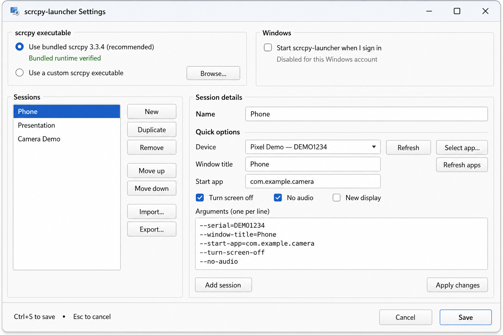

# scrcpy-launcher

scrcpy-launcher is a Windows 11 system-tray application for saving and launching
reusable [scrcpy](https://github.com/Genymobile/scrcpy) sessions. A session is a
named set of scrcpy command-line options for a particular device, application,
window layout, or use case.

The packaged application includes verified copies of scrcpy 4.1 and ADB. An
installed or portable user does not need Python or a separate scrcpy download.

## Choose an edition

| Edition | Best for | Configuration location |
| --- | --- | --- |
| Installer | Normal use with Start-menu integration and optional Windows autostart | `%APPDATA%\scrcpy-launcher\config.json` |
| Portable ZIP | Keeping the application and configuration together or carrying it between PCs | `config.json` beside `scrcpy-launcher.exe` |
| Source | Development and testing | `config.json` in the working directory by default |

## Five-minute quick start

### 1. Install and launch

Download the installer and its `.sha256` file from the same trusted release
location. From PowerShell, calculate the installer hash:

```powershell
Get-FileHash .\scrcpy-launcher-VERSION-setup.exe -Algorithm SHA256
Get-Content .\scrcpy-launcher-VERSION-setup.exe.sha256
```

Confirm that the two SHA-256 values match, then run the installer. Releases are
not currently Authenticode signed, so Windows may show an unknown-publisher or
reputation warning. Do not continue unless the file came from your trusted
release source and its checksum matches.

Leave **Launch scrcpy-launcher** selected on the final installer page, or launch
it later from the Start menu. The application runs in the notification area and
does not open a main window. If the icon is not visible beside the clock, open
the Windows hidden-icons menu.

### 2. Prepare the Android device

On the Android device:

1. Enable **Developer options**. On many devices, open **About phone** and tap
   **Build number** seven times; the exact labels vary by manufacturer.
2. Enable **USB debugging** in Developer options.
3. Connect the device to the PC with a data-capable USB cable.
4. Unlock the device and accept the USB-debugging authorization prompt. Enable
   **Always allow from this computer** only if you trust the PC.

### 3. Create the first session

1. Right-click the scrcpy-launcher tray icon and choose **Settings**.
2. Click **New**.
3. Enter a descriptive name such as `Phone`.
4. Choose the connected device. If it does not appear, click **Refresh**.
5. Optionally choose **Select app…**, search for an application, and select it.
6. Optionally set a window title and choose **Turn screen off**, **No audio**, or
   **New display**.
7. Click **Add session**, then **Save**.



*Machine-generated documentation image; all sessions, device identifiers, and
package names are fictional. Minor visual details may differ from the current
release.*

Right-click the tray icon and select the new session to launch it. Left-clicking
the tray icon launches the first session in the list.

## Tray controls

- **Left-click:** launch the first configured session.
- **Right-click:** launch any session, open Settings, check for updates, view
  About information, or quit.
- The menu reloads saved configuration each time it opens.
- While a tray-launched Settings window is open, **Settings** and **Quit** are
  disabled to protect unsaved changes. Close Settings first.

scrcpy sessions start without an additional console window. Closing a scrcpy
window does not quit the launcher; use **Quit** from the tray menu.

## Portable quick start

Extract the complete portable ZIP into a writable folder; do not run the
executable from inside the ZIP. Launch `scrcpy-launcher.exe`. On first launch,
the portable edition creates `config.json` beside the executable and uses its
bundled scrcpy runtime.

To upgrade, quit the tray and extract the newer ZIP over the existing portable
folder. Release ZIPs do not contain `config.json`, so the adjacent configuration
is preserved. Installed and portable editions use independent configurations.

## Common Settings tasks

- **Edit:** select a session, change it, click **Apply changes**, then **Save**.
  Save also applies pending edits to the selected session.
- **Duplicate:** select a session and click **Duplicate** to create an editable
  copy with a unique name.
- **Reorder:** use **Move up**, **Move down**, `Alt+Up`, or `Alt+Down`. The first
  session is the left-click default.
- **Remove:** select a session and click **Remove**, confirm, then save.
- **Back up sessions:** use **Export…**. Use **Import…** with **Merge** or
  **Replace** to restore them. Imported changes are not written until Save.
- **Windows autostart:** installed builds can start only the tray at sign-in;
  sessions are never launched automatically.
- **About:** displays the launcher and bundled scrcpy versions, license, and
  project link in a native Windows dialog.
- **Check for updates:** manually checks the latest GitHub Release and offers to
  open its page. It never downloads or installs an update.

Arguments are entered one per line. Quick controls synchronize with their
corresponding arguments while preserving advanced options. See the
[complete user guide](docs/user-guide.md) for detailed behavior, examples,
backups, recovery, and configuration locations.

## Troubleshooting

| Symptom | What to do |
| --- | --- |
| No tray icon | Check Windows' hidden-icons menu. If another launcher instance is running, quit it before starting a new one. |
| Device not listed | Unlock it, use a data-capable cable, enable USB debugging, accept the authorization prompt, then click **Refresh**. |
| Device is unauthorized | Accept the prompt on Android. If no prompt appears, revoke USB-debugging authorizations on the device, reconnect, and try again. |
| Device is offline | Disconnect and reconnect it, then refresh. Restarting the device or ADB may be necessary. |
| **Select app…** is disabled | Select a specific connected device and complete device refresh first. Custom scrcpy must support `--list-apps`. |
| Session closes immediately | Review the displayed scrcpy error, then check argument spelling, device state, and app package name. |
| Bundled runtime verification fails | Repair by rerunning the same installer, or reinstall from a release whose checksum you verified. |
| Configuration cannot be loaded | Use the startup recovery prompt to restore `config.json.bak` or open the configuration folder. |
| Settings is open and Quit is disabled | Close Settings with Save, Cancel, or `Esc`, then open the tray menu again. |
| Update check fails | Confirm that GitHub is reachable and try **Check for updates…** again. The failure does not affect saved sessions or launching. |

Rotating diagnostic logs are stored in:

```text
%LOCALAPPDATA%\scrcpy-launcher\tray.log
%LOCALAPPDATA%\scrcpy-launcher\settings.log
```

Logs mask common Windows profile paths and device serial contexts, but review
them before sharing because redaction is targeted rather than comprehensive.

The launcher makes no automatic internet requests. Selecting **Check for
updates…** sends an HTTPS request to GitHub's public Releases API containing the
launcher version in its user-agent. Configuration, sessions, device identifiers,
and application inventories are not sent.

## Uninstall

Open **Windows Settings > Apps > Installed apps**, find **scrcpy-launcher**, and choose
**Uninstall**. The uninstaller asks whether to remove known sessions, settings,
backups, recovery archives, and logs. Choose **No** to retain them for a future
installation. Silent uninstall preserves user data.

## Documentation

- [User guide](docs/user-guide.md)
- [Building and testing](docs/building.md)
- [Windows release lifecycle test](docs/windows-lifecycle-test.md)
- [Security policy](SECURITY.md)
- [Security model and accepted risks](docs/security-model.md)
- [Third-party notices](THIRD-PARTY-NOTICES.md)

## Development summary

Source development requires Windows 11, Python 3.10 or newer, and the locked
dependencies in `requirements.txt`. See [docs/building.md](docs/building.md) for
source setup, architecture, tests, dependency review, and release packaging.

## License

scrcpy-launcher is free software licensed under the
[GNU General Public License version 3 only](LICENSE), identified by
`GPL-3.0-only`. Packaged third-party components retain their original licenses;
see [THIRD-PARTY-NOTICES.md](THIRD-PARTY-NOTICES.md) and `licenses/`.
