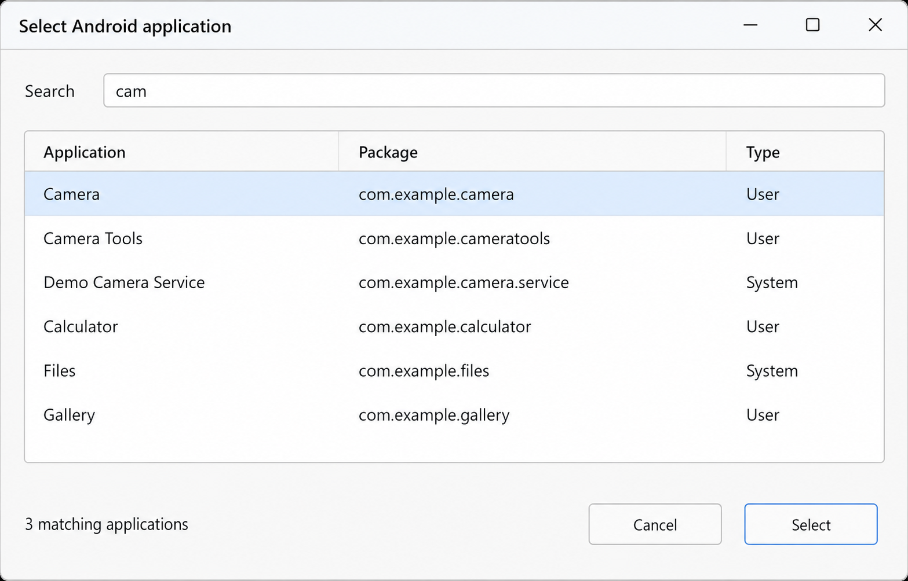

# scrcpy-launcher user guide

This guide covers the installed and portable Windows editions. For the shortest
path to a working session, start with the
[README quick start](../README.md#five-minute-quick-start).

## How the application works

scrcpy-launcher runs in the Windows notification area. It stores named sessions
and starts scrcpy with the arguments attached to the selected session. The tray
application remains available after a scrcpy window closes.

Only one tray instance can run in a Windows login session. Settings runs as a
separate process, and launched scrcpy sessions are independent processes.

## Application editions and storage

### Installed edition

```text
Application:   %LOCALAPPDATA%\Programs\scrcpy-launcher
Configuration: %APPDATA%\scrcpy-launcher\config.json
Backup:        %APPDATA%\scrcpy-launcher\config.json.bak
Logs:          %LOCALAPPDATA%\scrcpy-launcher
```

The installer creates a minimal bundled-mode configuration only if neither the
primary configuration nor its backup already exists. Upgrades and repairs do not
overwrite configuration.

### Portable edition

The portable ZIP contains `portable.marker` and `default-config.json`. On first
launch it creates `config.json` beside `scrcpy-launcher.exe`. Keep the whole
extracted directory together and use a location where the current user can write.

### Source edition

Source mode uses `config.json` in the current working directory unless an
explicit path is supplied. Windows autostart is intentionally unavailable.

## Tray behavior

- Left-click launches the first session.
- Right-click opens the current session menu.
- Right-click reloads the saved configuration before building the menu.
- Settings and Quit are unavailable while tray-launched Settings is open.
- **About scrcpy-launcher** displays version, license, bundled-runtime, and
  project information in a native Windows dialog.
- **Check for updates…** performs a user-requested GitHub release check.
- Quit stops only the tray; already-running scrcpy sessions remain independent.

## Creating a session

1. Open **Settings** from the tray menu.
2. Click **New**.
3. Enter a unique, single-line name.
4. Select a device or leave **Automatic** if scrcpy should choose.
5. Set quick options and any advanced arguments.
6. Click **Add session**.
7. Click **Save** to write the complete configuration.

New and imported sessions exist only in the Settings process until Save.
Cancel or `Esc` discards unsaved changes.


*Machine-generated documentation image using fictional data. Minor visual
details may differ from the current release.*

## Devices

Device discovery uses `adb.exe` from the selected scrcpy runtime and runs in the
background. The selector may report a device as authorized, unauthorized, or
offline.

- **Automatic** removes explicit `--serial` arguments and leaves device choice to
  scrcpy.
- Selecting a device inserts or replaces the session's `--serial` argument.
- A saved serial remains in the session when that device is temporarily absent.
- Editing a custom scrcpy path invalidates the old inventory. Click **Refresh**
  after finishing the path change.

If Android does not show its authorization prompt, disconnect it, revoke USB
debugging authorizations in Developer options, reconnect, and approve the PC.
USB menus and wording vary by manufacturer.

## Selecting an application

Choose a specific authorized device, then click **Select app…**. The browser
searches friendly names and package names and distinguishes system and user
applications. Selecting an application writes its exact package name into
**Start app** and synchronizes `--start-app` in the edit buffer.

The application list is cached for the lifetime of Settings. **Refresh apps**
queries the device again. A failed refresh keeps the last successful list and
does not alter the session being edited.

Only applications with a standard or Leanback launch intent are listed. A
custom scrcpy executable must support `--list-apps`; bundled scrcpy 4.1 does.



*Machine-generated documentation image; every displayed application and
package name is fictional.*

## Quick options and arguments

Arguments appear one per line. Blank lines are ignored.

| Control | Argument |
| --- | --- |
| Device | `--serial=DEVICE_SERIAL` |
| Window title | `--window-title=TITLE` |
| Start app | `--start-app=PACKAGE` |
| Turn screen off | `--turn-screen-off` |
| No audio | `--no-audio` |
| New display | `--new-display` |

Quick controls update matching arguments and preserve unrelated advanced
arguments. You may add any option supported by the selected scrcpy version. The
launcher passes saved arguments to scrcpy without shell interpretation.

Example session:

```text
--serial=DEVICE_SERIAL
--start-app=com.example.app
--window-title=Example
--turn-screen-off
--no-audio
```

## Editing and organizing sessions

- **Apply changes** updates the selected session in memory.
- **Save** applies pending selected-session edits and writes all settings.
- **Duplicate** inserts an editable copy after the selected session and chooses
  a unique name.
- **Move up** and **Move down** control tray order and the left-click default.
- **Remove** stages deletion after confirmation; Save makes it permanent.
- `Alt+Up` and `Alt+Down` reorder; `Ctrl+S` saves; `Esc` cancels.

Names are case-insensitively unique. A configuration can contain at most 500
sessions. Names are limited to 200 characters. Each session supports at most 256
arguments, 4,096 characters per argument, and 32,768 argument characters total.

## Session import and export

**Export…** writes a portable session-only JSON backup. It includes names and
arguments but excludes the scrcpy path and Windows autostart.

**Import… > Merge** appends sessions and renames case-insensitive conflicts with
`(2)`, `(3)`, and so on. **Replace** stages removal of the current list before
adding imported sessions. Both remain reversible until Save.

Imports validate the complete file before changing the in-memory list. The
maximum file size is 5 MiB. Malformed JSON, invalid sessions, duplicate names in
the backup, and unsupported format versions are rejected without partial import.

## Configuration and recovery

Save writes schema version 2 and preserves the previous valid file as
`config.json.bak`. An invalid primary file never replaces a valid backup.

If startup cannot load the primary configuration, the recovery prompt can:

- restore a valid backup and start;
- open the configuration folder and exit; or
- exit without changing files.

Restoration archives an invalid primary as
`config.json.corrupt-YYYYMMDD-HHMMSS`, installs a validated copy atomically, and
leaves the backup unchanged. Configuration files are limited to 5 MiB.

Advanced schema example:

```json
{
  "schema_version": 2,
  "scrcpy_mode": "bundled",
  "scrcpy_path": "scrcpy.exe",
  "sessions": [
    {
      "name": "Phone",
      "args": [
        "--serial=DEVICE_SERIAL",
        "--window-title=Phone",
        "--no-audio"
      ]
    }
  ]
}
```

Older unversioned and schema version 1 files are migrated in memory. Files from
a newer unsupported schema are rejected without rewriting them.

## Bundled and custom scrcpy

Bundled mode uses the packaged scrcpy 4.1 distribution under `tools\scrcpy`.
Before first use in each launcher or Settings process, the complete inventory is
checked against compiled-in SHA-256 hashes. A missing, changed, or unexpected
file is rejected and should be repaired by rerunning the trusted installer.

Custom mode accepts a specific executable path or an executable discoverable on
`PATH`. Device and application discovery use the ADB and features available in
that selected runtime. The launcher does not silently fall back between modes.

## Windows autostart

The installed edition can register the tray under the current user's Windows
Run key. It starts only scrcpy-launcher and never launches a session. Disabling
the option removes only a registration that belongs to the current installation.

## Updating and uninstalling

### Checking for updates

Choose **Check for updates…** from the tray menu. The request runs in the
background so configured sessions remain available. If a newer stable release
exists, the launcher can open its GitHub Release page in the default browser.

The update checker never downloads, installs, or executes a release. Download
the desired installer or portable ZIP yourself and verify its matching SHA-256
file before use. Network failures are nonfatal and do not change configuration.

No update check runs automatically or at startup. A manual check sends only a
standard HTTPS request to GitHub's public Releases API, including the launcher
version in the user-agent. It does not send configuration, session arguments,
device identifiers, or application inventories.

### Installing updates

Quit the tray before updating. Running a newer installer preserves installed
configuration. Rerunning the same installer repairs missing application files.

For portable updates, extract the new ZIP over the old portable directory only
after quitting. The release ZIP does not contain `config.json`.

Uninstall from **Windows Settings > Apps > Installed apps**. Choose **No** at the
user-data prompt to preserve configuration and logs. Confirmed removal deletes
known launcher data while preserving unknown files in those folders.

## Error diagnosis

User-facing startup, Settings, configuration, and scrcpy failures appear in
Windows dialogs. If scrcpy exits unsuccessfully, the full captured diagnostic is
shown interactively; persistent logs retain the exit code without third-party
stderr.

```text
%LOCALAPPDATA%\scrcpy-launcher\tray.log
%LOCALAPPDATA%\scrcpy-launcher\settings.log
```

Log files rotate at approximately 1 MiB with three backups. Common user-profile
paths and device serial contexts are masked, but review logs before sharing.
